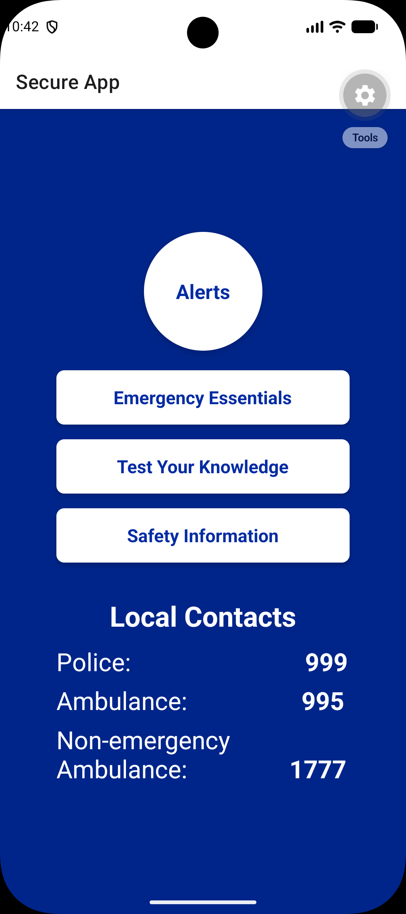

### [CM3070] Final Project - BSc CS University of London

<h1>
  A Mobile App for Local
  <br>Disaster Preparedness and Response
  <br><br><bold>by Vanessa Wong</bold>
</h1>

<br>

## About the project

This codebase is part of the **CM3070 Final Project** submission for the __University of London BSc Computer Science__ degree.

The project is about helping individuals and local communities prepare for, respond to, and recover from natural disasters. The primary goal is to demonstrate an engaging, reliable, safety-critical mobile application that shifts disaster management from a reactive model towards proactive preparedness. The app combines gamified preparedness activities with location-based emergency alerts and locally relevant safety information.

The app is built with **React Native** and **Expo**, allowing a single JavaScript/React codebase to run on both iOS and Android. Navigation is handled by **React Navigation**, location services by **expo-location**, and system notifications by **expo-notifications**. A defensive wrapper around the notifications library ensures the app degrades gracefully (no crashes) when notifications are unavailable in the runtime environment.



## Directory Structure of the project

The following is the directory structure of the project along with some explanations of each file.

- App.js # Main app entry point: all screens, navigation, and styles
- notificationsHelper.js # Defensive wrapper around expo-notifications
- README.md # This file
- package.json # Project dependencies and scripts
- app.json # Expo project configuration

## Packages required for this project

The app is built with Expo, so packages are installed with `npx expo install` to ensure
versions compatible with the Expo SDK are selected.

```bash
npx expo install @react-navigation/native @react-navigation/native-stack
npx expo install react-native-screens react-native-safe-area-context
npx expo install expo-location expo-notifications
npx expo install @react-native-async-storage/async-storage
```

Other Requirements:

1. Node.js (LTS) and npm
2. Expo Go installed on a physical iOS or Android device, or an Android/iOS simulator
3. A device or emulator with location services enabled to test the Alerts screen

## Setup instructions

1. Clone this repository:
git clone https://github.com/wtvwong/CM3070.git
<br>cd CM3070

2. Install dependencies:
```bash
npm install
npx expo install @react-navigation/native @react-navigation/native-stack
npx expo install react-native-screens react-native-safe-area-context
npx expo install expo-location expo-notifications
npx expo install @react-native-async-storage/async-storage
```

3. Start the Expo development server:
npm start

4. Scan the QR code with the Expo Go app on your device, or launch the iOS Simulator or Android Emulator.
